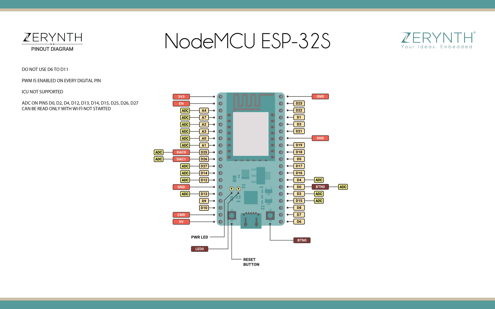

### SurveyBox

SurveyBox is the on-the-ground data collection device used by [ModeSurvey](https://modesurvey.org). ModeSurvey attempts to understand the different modes by whic we interact with the world. Primarily, we are interested in transportation modes and how people move around in a city: walking, biking, transit, and car.

This repo contains the information, source, and instructions for SurveyBox.

### Construction

The main chip for the SurveyBox is an ESP32. The exact dev kit can be found at the following [amazon link](https://www.amazon.com/KeeYees-Development-Bluetooth-Microcontroller-ESP-WROOM-32/dp/B07QCP2451). This devkit consists of the ESP-WROOM-32 on a nodemcu style board. The pinout diagrams can be found in the `docs` folder. The nicer looking one is reproduced below.

For wiring up the board, the following are the assumed pins for input and output of the different LEDs, and buttons.

WALK BUTTON: 23
WHEELS BUTTON: 22
TRANSIT_BUTTON: 21
CAR BUTTON: 19

WALK LED: 25
WHEELS LED: 26
TRANSIT LED: 27
CAR LED: 14

#### Setup

When starting surveybox it is necessary to setup it up to connect to the local wifi, and also to tell the box for which account the data is being collected for. The general idea for this is that esp32 will create a wifi hotspot and serve up a setup page for connecting to wifi dynamically.

1. Open up Wifi connections on phone, and connect to "modesurvey_ap". Wait up to 1 minute for it to show up. Connect to this wifi network and wait for the login page to show up. The password is "countthemode".
2. After connecting, the box will flash the status change signal which is WALK, WHEELS, TRANSIT, CAR for two seconds each.
3. After your phone is connected you may see an autologin browser session open to a url like "[ESP32 Ip Address]/\_ac". Usually this happens without problem on iPhone. Otherwise, open up your browser and connect to gstatic.com. gstatic.com will autoresolve to the login session.
4. Once on the AutoConnect start page, click the menu bar in the top right and select "Configure New AP".
5. Once here, you will be able to connect to the wifi network of your choice by clicking on the network, and typing in the password for this wifi network.
6. After connecting, the status page will say the ip address of the device on the network you entered. Mark down this ip address.
7. Connect onto the same wifi as the box, and type in "[IPAddress]/stream_selection". This will show up a page with all the possible streams to select to set the box to. One of these will be a test stream for local testing. Select the appropriate stream.
8. Put the box in the desired location and let the data roll in.

This functionality is primary given by [AutoConnect](https://github.com/Hieromon/AutoConnect), and more information can be found at the listed repo.

### Credits

The base64 functionality included in this project was adapted from [ReneNyffenegger](https://github.com/ReneNyffenegger/cpp-base64/blob/master/base64.cpp), and extended for url-safe conversions.

Enjoy!

- ModeSurvey Team
